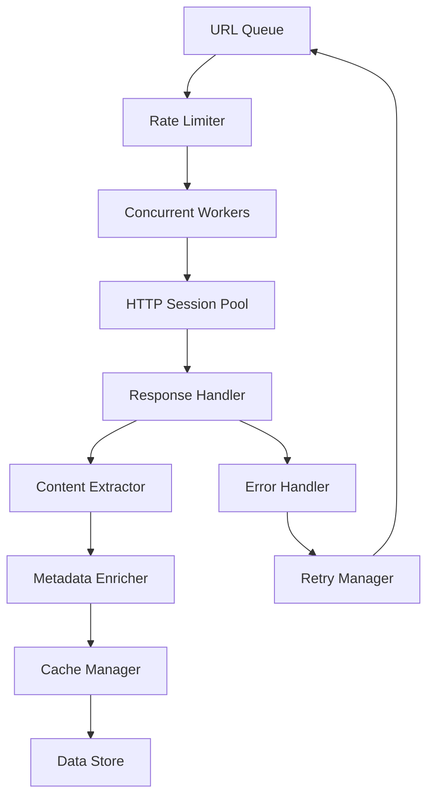

# System Architecture

Comprehensive overview of the Universal RAG System's architecture, design decisions, and component interactions.

## 🏗️ High-Level Architecture

The Universal RAG System follows a modular, three-layer architecture designed for scalability and performance:

```
┌─────────────────────────────────────────────────────────────────┐
│                    Universal RAG System                        │
├─────────────────────────────────────────────────────────────────┤
│                                                                 │
│  ┌─────────────┐    ┌──────────────┐    ┌─────────────────┐     │
│  │ Web Scraper │───▶│ RAG System   │───▶│ Text Generator  │     │
│  │             │    │              │    │ (Ollama)        │     │
│  │ • Async     │    │ • Retrieval  │    │ • Local LLMs    │     │
│  │ • Sync      │    │ • Caching    │    │ • API Interface │     │
│  │ • Metadata  │    │ • Indexing   │    │ • Model Mgmt    │     │
│  └─────────────┘    └──────────────┘    └─────────────────┘     │
│         │                   │                      │            │
│  ┌─────────────┐    ┌──────────────┐    ┌─────────────────┐     │
│  │ Data Store  │    │ Vector Index │    │ Query Processor │     │
│  │             │    │              │    │                 │     │
│  │ • JSON      │    │ • TF-IDF     │    │ • Enhancement   │     │
│  │ • Cache     │    │ • Trigrams   │    │ • Context Build │     │
│  │ • Metadata  │    │ • Scoring    │    │ • Result Rank   │     │
│  └─────────────┘    └──────────────┘    └─────────────────┘     │
│                                                                 │
└─────────────────────────────────────────────────────────────────┘
```

## 📦 Core Components

### 1. Web Scraping Layer

#### Dual Scraper Architecture

The system implements two complementary scraping strategies:

```python
# Synchronous Scraper - Reliability First
class WebScraper:
    """
    Optimized for:
    - Development and debugging
    - Detailed error reporting
    - Step-by-step processing
    - Small to medium websites
    """

# Asynchronous Scraper - Performance First
class AsyncWebScraper:
    """
    Optimized for:
    - Production environments
    - Large-scale scraping (3-5x faster)
    - Concurrent processing
    - High-throughput scenarios
    """
```

#### Architecture Flow



#### Key Design Decisions

**1. Structure Preservation**
```python
# HTML hierarchy is maintained throughout processing
{
    "content": "Function definition content...",
    "metadata": {
        "section_hierarchy": ["Tutorial", "Functions", "Definition"],
        "content_type": "paragraph",
        "page_title": "Python Functions"
    }
}
```

**2. Semantic Chunking**
```python
# Content is chunked by meaning, not arbitrary word limits
chunk_boundaries = [
    "heading_changes",      # h1, h2, h3 transitions
    "section_breaks",       # Natural content divisions
    "code_block_boundaries", # Preserve complete code examples
    "list_completions"      # Keep lists intact
]
```

**3. Metadata Enrichment**
```python
metadata_layers = {
    "structural": ["content_type", "section_hierarchy"],
    "contextual": ["page_title", "url", "domain"],
    "temporal": ["scrape_timestamp", "cache_key"],
    "quality": ["content_length", "relevance_signals"]
}
```

### 2. RAG Processing Layer

#### Document Processing Pipeline

```
Raw HTML → Content Extract → Semantic Chunk → Index Build → Query Ready
    │             │              │              │            │
   DOM         Sections      Hierarchical    TF-IDF       Vector
  Parse         + Meta       Chunks + Meta   Vectors       Store
```

#### Enhanced TF-IDF Implementation

```python
class EnhancedTFIDF:
    """
    Advanced TF-IDF with multiple enhancements:

    1. Trigram Analysis: Better phrase matching
    2. Sublinear Scaling: Prevents term frequency dominance
    3. Content Boosting: Weights by content type importance
    4. Domain Tuning: Adjusts for technical vs general content
    """

    def compute_similarity(self, query_vector, doc_vector, metadata):
        base_score = cosine_similarity(query_vector, doc_vector)

        # Apply content type boosting
        content_boost = self.get_content_boost(metadata['content_type'])

        # Apply hierarchy boosting
        hierarchy_boost = self.get_hierarchy_boost(metadata['section_hierarchy'])

        return base_score * content_boost * hierarchy_boost
```

#### Caching Architecture

```python
# Multi-level caching strategy
cache_layers = {
    "content_cache": {
        "key": "sha256(url + timestamp)",
        "storage": "pickle files",
        "ttl": "7 days",
        "purpose": "Raw scraped content"
    },
    "vector_cache": {
        "key": "sha256(processed_content)",
        "storage": "memory + disk",
        "ttl": "persistent",
        "purpose": "TF-IDF vectors"
    },
    "query_cache": {
        "key": "sha256(query + top_k)",
        "storage": "memory",
        "ttl": "1 hour",
        "purpose": "Query results"
    }
}
```

### 3. Generation Layer

#### Ollama Integration Architecture

```
┌─────────────┐    ┌─────────────┐    ┌─────────────┐
│  Retrieved  │───▶│   Context   │───▶│   Ollama    │
│   Chunks    │    │   Builder   │    │    API      │
└─────────────┘    └─────────────┘    └─────────────┘
       │                  │                  │
┌─────────────┐    ┌─────────────┐    ┌─────────────┐
│  Metadata   │    │   Prompt    │    │  Response   │
│ Filtering   │    │ Template    │    │ Processing  │
└─────────────┘    └─────────────┘    └─────────────┘
```

#### Local LLM Benefits

```python
advantages = {
    "privacy": "No data sent to external services",
    "speed": "Local processing eliminates network latency",
    "cost": "No per-request API charges",
    "customization": "Full control over model selection",
    "reliability": "No external API dependencies"
}
```

## 🔄 Data Flow Architecture

### Complete Processing Pipeline


### Data Structures

#### Document Representation
```json
{
    "content": "Complete text content of the chunk",
    "content_type": "paragraph|heading|code|list",
    "metadata": {
        "url": "https://example.com/page",
        "page_title": "Page Title",
        "section_hierarchy": ["Main Section", "Subsection"],
        "domain": "example.com",
        "scrape_timestamp": "2024-12-15T10:30:00Z",
        "content_length": 342,
        "cache_key": "sha256_hash"
    },
    "vector_data": {
        "tfidf_vector": [0.1, 0.3, 0.0, ...],
        "vocabulary_indices": [45, 123, 678, ...],
        "vector_norm": 1.0
    }
}
```

#### Query Result Structure
```json
{
    "query": "original user query",
    "processing_time": 0.045,
    "chunks": [
        {
            "content": "relevant content text",
            "score": 0.756,
            "metadata": { "..." },
            "match_details": {
                "matched_terms": ["function", "define"],
                "term_frequencies": [0.3, 0.2],
                "boost_applied": 1.2
            }
        }
    ],
    "cache_info": {
        "was_cached": false,
        "cache_key": "query_hash"
    }
}
```

## 🚀 Performance Architecture

### Async Processing Model

```python
# Concurrent Processing Architecture
async def process_urls_concurrently():
    semaphore = asyncio.Semaphore(concurrent_limit)
    session_pool = aiohttp.ClientSession(
        connector=aiohttp.TCPConnector(limit=100),
        timeout=aiohttp.ClientTimeout(total=30)
    )

    tasks = []
    for url in url_queue:
        task = asyncio.create_task(
            bounded_fetch(semaphore, session_pool, url)
        )
        tasks.append(task)

    results = await asyncio.gather(*tasks, return_exceptions=True)
    return results
```

### Memory Management

```python
# Streaming processing for large datasets
class StreamingProcessor:
    def __init__(self, batch_size=100):
        self.batch_size = batch_size

    async def process_stream(self, url_stream):
        batch = []
        async for url in url_stream:
            batch.append(url)

            if len(batch) >= self.batch_size:
                await self.process_batch(batch)
                batch.clear()  # Release memory
                gc.collect()   # Force cleanup

        # Process remaining items
        if batch:
            await self.process_batch(batch)
```

### Optimization Strategies

#### 1. Connection Pooling
```python
# HTTP connection reuse
connector = aiohttp.TCPConnector(
    limit=100,              # Total connections
    limit_per_host=10,      # Per-host limit
    keepalive_timeout=30,   # Keep connections alive
    enable_cleanup_closed=True
)
```

#### 2. Rate Limiting
```python
class AdaptiveRateLimiter:
    def __init__(self, base_rate=6.0):
        self.rate = base_rate
        self.last_request = 0
        self.failure_count = 0

    async def acquire(self):
        # Adaptive rate adjustment
        if self.failure_count > 3:
            self.rate *= 0.8  # Slow down
        elif self.failure_count == 0:
            self.rate = min(self.rate * 1.1, 12.0)  # Speed up

        await asyncio.sleep(1.0 / self.rate)
```

#### 3. Smart Caching
```python
class IntelligentCache:
    def __init__(self):
        self.memory_cache = {}  # Hot data
        self.disk_cache = {}    # Cold data

    def get_cache_key(self, url, content_hash):
        # Content-based caching
        return hashlib.sha256(
            f"{url}:{content_hash}".encode()
        ).hexdigest()

    def should_cache(self, content_size, access_frequency):
        # Intelligent caching decisions
        return content_size > 1000 and access_frequency > 0.1
```

## 🔧 Configuration Architecture

### Hierarchical Configuration

```python
# Configuration inheritance and override system
class ConfigurationManager:
    def __init__(self):
        self.config_layers = [
            "system_defaults",    # Base configuration
            "environment_config", # Environment variables
            "user_config",       # User-specified settings
            "runtime_overrides"  # Dynamic adjustments
        ]

    def get_effective_config(self, component):
        config = {}
        for layer in self.config_layers:
            layer_config = self.load_layer_config(layer, component)
            config.update(layer_config)
        return config
```

### Environment Adaptation

```python
def adapt_to_environment():
    # Automatically adjust based on system capabilities
    system_info = get_system_info()

    if system_info['memory_gb'] > 16:
        return high_performance_config
    elif system_info['memory_gb'] > 8:
        return balanced_config
    else:
        return conservative_config
```

## 🛡️ Error Handling Architecture

### Resilience Patterns

```python
# Circuit breaker pattern for external dependencies
class CircuitBreaker:
    def __init__(self, failure_threshold=5, recovery_timeout=60):
        self.failure_threshold = failure_threshold
        self.recovery_timeout = recovery_timeout
        self.failure_count = 0
        self.state = "closed"  # closed, open, half-open

    async def call(self, func, *args, **kwargs):
        if self.state == "open":
            if time.time() - self.last_failure < self.recovery_timeout:
                raise CircuitBreakerOpenError()
            else:
                self.state = "half-open"

        try:
            result = await func(*args, **kwargs)
            self.reset()
            return result
        except Exception as e:
            self.record_failure()
            raise
```

### Retry Strategies

```python
# Exponential backoff with jitter
class RetryManager:
    def __init__(self, max_retries=3, base_delay=1.0):
        self.max_retries = max_retries
        self.base_delay = base_delay

    async def retry_with_backoff(self, func, *args, **kwargs):
        for attempt in range(self.max_retries + 1):
            try:
                return await func(*args, **kwargs)
            except RetryableError as e:
                if attempt == self.max_retries:
                    raise

                # Exponential backoff with jitter
                delay = self.base_delay * (2 ** attempt)
                jitter = random.uniform(0, delay * 0.1)
                await asyncio.sleep(delay + jitter)
```

## 📊 Monitoring Architecture

### Metrics Collection

```python
# Comprehensive metrics system
class MetricsCollector:
    def __init__(self):
        self.metrics = {
            "scraping": {
                "pages_processed": Counter(),
                "processing_time": Histogram(),
                "error_rate": Gauge(),
                "cache_hit_rate": Gauge()
            },
            "queries": {
                "response_time": Histogram(),
                "similarity_scores": Histogram(),
                "cache_hits": Counter()
            },
            "system": {
                "memory_usage": Gauge(),
                "cpu_utilization": Gauge(),
                "disk_usage": Gauge()
            }
        }

    def record_scraping_time(self, duration):
        self.metrics["scraping"]["processing_time"].observe(duration)

    def record_query_similarity(self, score):
        self.metrics["queries"]["similarity_scores"].observe(score)
```

### Health Checks

```python
class HealthChecker:
    def __init__(self):
        self.checks = [
            self.check_data_availability,
            self.check_cache_health,
            self.check_system_resources,
            self.check_ollama_connection
        ]

    async def run_health_checks(self):
        results = {}
        for check in self.checks:
            try:
                results[check.__name__] = await check()
            except Exception as e:
                results[check.__name__] = {"status": "failed", "error": str(e)}

        return results
```

## 🔮 Extensibility Architecture

### Plugin System

```python
# Plugin architecture for extensibility
class PluginManager:
    def __init__(self):
        self.plugins = {}

    def register_plugin(self, name, plugin_class):
        self.plugins[name] = plugin_class()

    def execute_hook(self, hook_name, *args, **kwargs):
        results = []
        for plugin in self.plugins.values():
            if hasattr(plugin, hook_name):
                result = getattr(plugin, hook_name)(*args, **kwargs)
                results.append(result)
        return results

# Example content processor plugin
class CustomContentProcessor:
    def process_content(self, content, metadata):
        # Custom content processing logic
        enhanced_content = self.enhance_content(content)
        return enhanced_content
```

### Interface Abstractions

```python
# Abstract interfaces for component substitution
from abc import ABC, abstractmethod

class WebScraperInterface(ABC):
    @abstractmethod
    async def scrape_website(self, urls: List[str]) -> bool:
        pass

    @abstractmethod
    def extract_content(self, html: str, url: str) -> List[Dict]:
        pass

class RetrievalInterface(ABC):
    @abstractmethod
    def query(self, query: str, top_k: int) -> List[Dict]:
        pass

    @abstractmethod
    def index_documents(self, documents: List[Dict]) -> bool:
        pass
```

## 📈 Scalability Considerations

### Horizontal Scaling

```python
# Distributed processing architecture
class DistributedRAGSystem:
    def __init__(self, worker_nodes):
        self.worker_nodes = worker_nodes
        self.load_balancer = LoadBalancer(worker_nodes)

    async def distributed_scraping(self, urls):
        # Distribute URLs across worker nodes
        url_batches = self.partition_urls(urls)

        tasks = []
        for i, batch in enumerate(url_batches):
            worker = self.worker_nodes[i % len(self.worker_nodes)]
            task = worker.process_batch(batch)
            tasks.append(task)

        results = await asyncio.gather(*tasks)
        return self.merge_results(results)
```

### Vertical Scaling

```python
# Resource optimization for single-node scaling
class ResourceOptimizer:
    def optimize_for_system(self, system_specs):
        memory_gb = system_specs['memory']
        cpu_cores = system_specs['cores']

        # Memory-based optimization
        if memory_gb > 32:
            concurrent_limit = min(cpu_cores * 2, 16)
            batch_size = 200
        elif memory_gb > 16:
            concurrent_limit = cpu_cores
            batch_size = 100
        else:
            concurrent_limit = max(2, cpu_cores // 2)
            batch_size = 50

        return ScrapingConfig(
            concurrent_limit=concurrent_limit,
            max_pages=batch_size
        )
```

## 🔒 Security Architecture

### Data Protection

```python
class SecurityManager:
    def __init__(self):
        self.data_validator = DataValidator()
        self.access_controller = AccessController()

    def sanitize_content(self, content):
        # Remove potentially malicious content
        sanitized = self.data_validator.clean_html(content)
        return self.data_validator.validate_text(sanitized)

    def validate_url(self, url):
        # URL validation and filtering
        if not self.access_controller.is_allowed_domain(url):
            raise SecurityError(f"Domain not allowed: {url}")

        if self.access_controller.is_suspicious_url(url):
            raise SecurityError(f"Suspicious URL detected: {url}")
```

### Privacy Considerations

```python
# Privacy-preserving architecture
class PrivacyManager:
    def __init__(self):
        self.pii_detector = PIIDetector()

    def process_content_safely(self, content):
        # Detect and remove PII
        if self.pii_detector.contains_pii(content):
            content = self.pii_detector.redact_pii(content)

        return content

    def generate_anonymous_metrics(self, usage_data):
        # Generate analytics without exposing user data
        return self.anonymize_usage_patterns(usage_data)
```

## 🎯 Design Principles

### 1. Modularity
- **Component Independence**: Each component can be developed and tested independently
- **Interface Contracts**: Well-defined APIs between components
- **Pluggable Architecture**: Easy to swap implementations

### 2. Performance
- **Async-First Design**: Non-blocking operations for scalability
- **Intelligent Caching**: Multi-level caching strategy
- **Resource Optimization**: Adaptive resource usage

### 3. Reliability
- **Graceful Degradation**: System continues operating with reduced functionality
- **Error Recovery**: Automatic retry and circuit breaker patterns
- **Data Consistency**: Transactional data operations

### 4. Extensibility
- **Plugin System**: Easy addition of new functionality
- **Configuration Management**: Hierarchical and override-friendly config
- **API Versioning**: Backward compatibility maintenance

This architecture provides a solid foundation for a scalable, performant, and maintainable RAG system while remaining flexible enough to accommodate future enhancements and different use cases.

---

*For implementation details, see the [API Documentation](./api/README.md) and [Getting Started Guide](./guides/getting-started.md).*