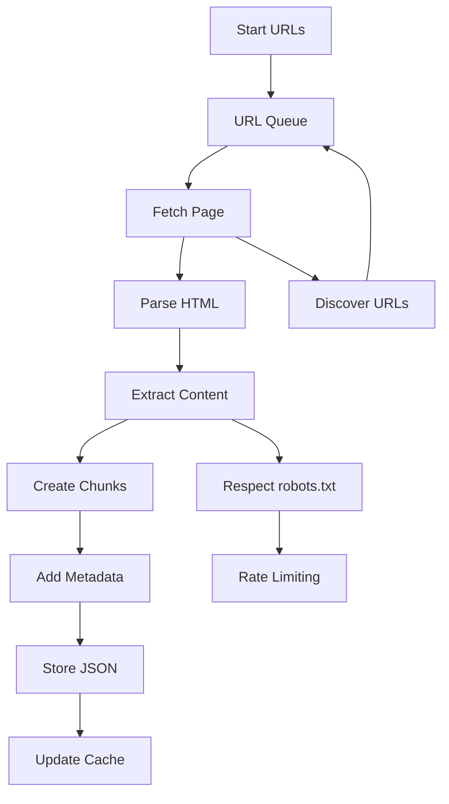
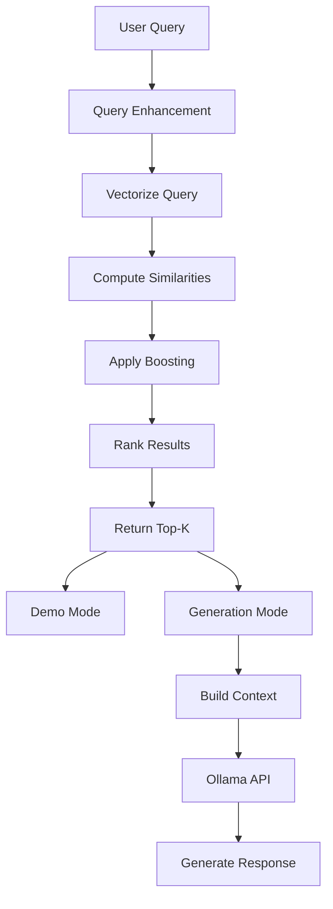

# System Architecture

This document provides a comprehensive overview of the Universal RAG System's architecture, design decisions, and component interactions.

## 🏗️ High-Level Architecture

```
┌─────────────────────────────────────────────────────────────────┐
│                    Universal RAG System                        │
├─────────────────────────────────────────────────────────────────┤
│                                                                 │
│  ┌─────────────┐    ┌──────────────┐    ┌─────────────────┐     │
│  │ Web Scraper │───▶│ RAG System   │───▶│ Text Generator  │     │
│  │             │    │              │    │ (Ollama)        │     │
│  │ • Async     │    │ • Retrieval  │    │ • Local LLMs    │     │
│  │ • Sync      │    │ • Caching    │    │ • API Interface │     │
│  │ • Metadata  │    │ • Indexing   │    │ • Model Mgmt    │     │
│  └─────────────┘    └──────────────┘    └─────────────────┘     │
│         │                   │                      │            │
│  ┌─────────────┐    ┌──────────────┐    ┌─────────────────┐     │
│  │ Data Store  │    │ Vector Index │    │ Query Processor │     │
│  │             │    │              │    │                 │     │
│  │ • JSON      │    │ • TF-IDF     │    │ • Enhancement   │     │
│  │ • Cache     │    │ • Trigrams   │    │ • Context Build │     │
│  │ • Metadata  │    │ • Scoring    │    │ • Result Rank   │     │
│  └─────────────┘    └──────────────┘    └─────────────────┘     │
│                                                                 │
└─────────────────────────────────────────────────────────────────┘
```

## 📦 Core Components

### 1. Web Scraping Layer

#### Synchronous Web Scraper (`web_scraper.py`)
- **Purpose**: Reliable, debuggable web scraping
- **Features**: Structure preservation, robots.txt compliance, content extraction
- **Use Case**: Development, testing, small-scale scraping

#### Asynchronous Web Scraper (`async_web_scraper.py`)
- **Purpose**: High-performance concurrent scraping
- **Features**: Async I/O, connection pooling, rate limiting
- **Use Case**: Production, large-scale scraping, performance-critical applications

```python
# Architecture Flow
┌─────────────┐    ┌─────────────┐    ┌─────────────┐
│   Request   │───▶│  Response   │───▶│  Extract    │
│   Queue     │    │  Handler    │    │  Content    │
└─────────────┘    └─────────────┘    └─────────────┘
       │                  │                  │
┌─────────────┐    ┌─────────────┐    ┌─────────────┐
│ Rate Limit  │    │   Cache     │    │  Metadata   │
│ Manager     │    │  Manager    │    │  Enricher   │
└─────────────┘    └─────────────┘    └─────────────┘
```

#### Key Design Decisions

**Structure Preservation**:
- Maintains HTML hierarchy (h1 → h2 → h3)
- Preserves semantic relationships between content
- Enables context-aware chunking

**Metadata Enrichment**:
- Page titles and section hierarchies
- Content types (heading, paragraph, code, list)
- Domain and URL information
- Timestamp and caching metadata

### 2. RAG Processing Layer

#### Document Processing Pipeline

```
Raw HTML → Content Extract → Semantic Chunk → Index Build → Query Ready
    │             │              │              │            │
   DOM         Sections      Hierarchical    TF-IDF       Vector
  Parse         + Meta       Chunks + Meta   Vectors       Store
```

#### Retrieval System Architecture

```python
# TF-IDF Enhancement Pipeline
┌─────────────┐    ┌─────────────┐    ┌─────────────┐
│   Query     │───▶│  Enhance    │───▶│  Vectorize  │
│ Processing  │    │   Terms     │    │   Query     │
└─────────────┘    └─────────────┘    └─────────────┘
       │                  │                  │
┌─────────────┐    ┌─────────────┐    ┌─────────────┐
│  Similarity │    │  Metadata   │    │   Rank &    │
│ Computation │    │   Boost     │    │   Return    │
└─────────────┘    └─────────────┘    └─────────────┘
```

#### Key Features

**Enhanced TF-IDF**:
- Trigram analysis for better matching
- Sublinear term frequency scaling
- Content type-based score boosting
- Domain-specific relevance tuning

**Intelligent Caching**:
- Content-based cache keys (SHA-256)
- Automatic invalidation strategies
- Memory-efficient storage
- Cross-session persistence

### 3. Generation Layer

#### Ollama Integration Architecture

```
┌─────────────┐    ┌─────────────┐    ┌─────────────┐
│  Retrieved  │───▶│   Context   │───▶│   Ollama    │
│   Chunks    │    │   Builder   │    │    API      │
└─────────────┘    └─────────────┘    └─────────────┘
       │                  │                  │
┌─────────────┐    ┌─────────────┐    ┌─────────────┐
│  Metadata   │    │   Prompt    │    │  Response   │
│ Filtering   │    │ Template    │    │ Processing  │
└─────────────┘    └─────────────┘    └─────────────┘
```

#### Local LLM Benefits
- **Privacy**: No data sent to external services
- **Speed**: Local processing eliminates network latency
- **Cost**: No per-request API charges
- **Customization**: Full control over model selection and parameters

## 🔄 Data Flow Architecture

### Scraping to Storage Flow



### Query Processing Flow



## 📊 Performance Architecture

### Async Scraping Performance

```python
# Concurrent Processing Model
┌─────────────────┐
│   Main Thread   │
│  ┌───────────┐  │
│  │  Async    │  │──┐
│  │  Event    │  │  │  ┌─────────────┐
│  │   Loop    │  │  ├─▶│  Worker 1   │
│  └───────────┘  │  │  └─────────────┘
└─────────────────┘  │  ┌─────────────┐
                     ├─▶│  Worker 2   │
                     │  └─────────────┘
                     │  ┌─────────────┐
                     └─▶│  Worker N   │
                        └─────────────┘
```

#### Performance Optimizations

**Connection Management**:
- Session pooling for connection reuse
- Configurable connection limits
- Automatic connection cleanup

**Memory Management**:
- Streaming content processing
- Garbage collection optimization
- Memory usage monitoring

**Caching Strategy**:
- Multi-level caching (memory + disk)
- Content-based cache keys
- Intelligent cache invalidation

### Retrieval Performance

#### TF-IDF Optimization

```python
# Vectorization Pipeline
Text → Tokenize → N-grams → TF → IDF → Vector
  │        │         │      │     │      │
Clean   Split     Build   Count  Calc   Norm
Text    Terms    Grams   Freq   Weight  Vector
```

**Performance Characteristics**:
- **Indexing**: O(n×m) where n=documents, m=average terms
- **Query**: O(k×m) where k=query terms, m=vocabulary size
- **Memory**: Linear with vocabulary size and document count

#### Scoring Algorithm

```python
def enhanced_similarity_score(query_vector, doc_vector, metadata):
    # Base TF-IDF similarity
    base_score = cosine_similarity(query_vector, doc_vector)

    # Content type boosting
    content_boost = get_content_boost(metadata['content_type'])

    # Section hierarchy boost
    hierarchy_boost = get_hierarchy_boost(metadata['section_hierarchy'])

    # Final enhanced score
    return base_score * content_boost * hierarchy_boost
```

## 🛠️ Design Patterns

### 1. Strategy Pattern - Multiple Scrapers

```python
class ScrapingStrategy:
    def scrape(self, urls: List[str]) -> bool:
        raise NotImplementedError

class AsyncScrapingStrategy(ScrapingStrategy):
    def scrape(self, urls: List[str]) -> bool:
        return asyncio.run(self._async_scrape(urls))

class SyncScrapingStrategy(ScrapingStrategy):
    def scrape(self, urls: List[str]) -> bool:
        return self._sync_scrape(urls)
```

### 2. Factory Pattern - Content Extractors

```python
class ContentExtractorFactory:
    @staticmethod
    def get_extractor(content_type: str) -> ContentExtractor:
        if content_type == 'documentation':
            return DocumentationExtractor()
        elif content_type == 'blog':
            return BlogExtractor()
        else:
            return GenericExtractor()
```

### 3. Observer Pattern - Progress Tracking

```python
class ScrapingObserver:
    def on_page_scraped(self, url: str, success: bool):
        pass

class ProgressTracker(ScrapingObserver):
    def on_page_scraped(self, url: str, success: bool):
        self.update_progress(url, success)
```

## 🚀 Scalability Considerations

### Horizontal Scaling

**Distributed Scraping**:
- URL queue distribution
- Worker node coordination
- Result aggregation
- Load balancing

**Shared Storage**:
- Centralized data store
- Distributed caching
- Consistent metadata
- Conflict resolution

### Vertical Scaling

**Resource Optimization**:
- Memory usage profiling
- CPU utilization monitoring
- I/O bottleneck identification
- Performance tuning

**Capacity Planning**:
- Growth projection models
- Resource requirement estimation
- Performance degradation thresholds
- Scaling trigger points

## 🔒 Security Architecture

### Web Scraping Security

**Respectful Crawling**:
- robots.txt compliance
- Rate limiting enforcement
- User-agent identification
- Session management

**Data Protection**:
- Secure data storage
- Access control mechanisms
- Data retention policies
- Privacy compliance

### API Security

**Local LLM Security**:
- Network isolation
- Access control
- Model validation
- Resource limits

## 📈 Monitoring & Observability

### Performance Metrics

```python
@dataclass
class SystemMetrics:
    scraping_performance: ScrapingMetrics
    retrieval_performance: RetrievalMetrics
    generation_performance: GenerationMetrics
    system_resources: ResourceMetrics
```

### Health Checks

- **Scraping Health**: Success rates, error patterns
- **Retrieval Health**: Query performance, result quality
- **Generation Health**: API availability, response times
- **System Health**: Resource usage, error rates

## 🔮 Future Architecture Considerations

### Planned Enhancements

1. **Multi-modal Support**: Images, PDFs, videos
2. **Advanced Retrieval**: Semantic embeddings, hybrid search
3. **Distributed Processing**: Multi-node coordination
4. **Real-time Updates**: Change detection, incremental updates

### Technology Evolution

- **Vector Databases**: Integration with specialized vector stores
- **Advanced LLMs**: Support for larger, more capable models
- **Edge Computing**: Deployment to edge environments
- **Cloud Integration**: Hybrid cloud-local architectures

---

This architecture provides a solid foundation for scalable, performant, and maintainable RAG systems while maintaining flexibility for future enhancements.