# Technology Decision Tree & Logic Flow

## 🌳 Decision-Making Framework

This document outlines the logical decision tree used to select technologies for the Universal RAG Web Application, providing a systematic approach to evaluating options.

## 🔄 Decision Process Overview


## 📋 Core Requirements That Drive Decisions

### 1. Security Requirements (PRIMARY)
```
CRITICAL SECURITY REQUIREMENTS:
- 🔒 ZERO external data transmission
- 🏠 Complete local data processing
- 🚫 NO cloud service dependencies
- 🛡️ Air-gap deployment capability
- 📋 GDPR/HIPAA compliance through local control
- 🔐 Local encryption at rest and in transit

Must Have:
- Local Ollama model integration (NO external AI APIs)
- Local vector storage (NO external vector databases)
- Local file processing (NO cloud storage)
- Local user authentication (NO external auth services)
- Local chat history (NO external logging)
```

### 2. Functional Requirements (SECONDARY)
```
Must Have:
- Real-time chat interface with WebSocket support
- Document upload and URL processing capabilities
- Vector similarity search for RAG
- Multi-user support with data isolation
- Responsive web interface

Should Have:
- Chat conversation history
- Multiple model selection
- File format support (PDF, HTML, TXT)
- Dark/light theme support
- Mobile-responsive design

Could Have:
- Advanced analytics (local only)
- Multi-language support
- API rate limiting
- Advanced user management
```

### 3. Non-Functional Requirements (TERTIARY)
```
Performance (while maintaining local control):
- Chat response time: <500ms
- Document processing: <30s for typical docs
- Search latency: <100ms
- Concurrent users: 500-1000 initially

Scalability (within local infrastructure):
- Growth path to 100K users on local infrastructure
- Horizontal scaling capability (multiple local servers)
- Database scaling options (local read replicas)

Reliability (with local control):
- 99.5% uptime target
- Data consistency and backup (local)
- Graceful error handling
- Local disaster recovery

Cost Optimization (through local hosting):
- Minimize infrastructure costs
- No external service fees
- Predictable operational costs
```

## 🏗️ Architecture Decision Tree

### Decision 0: Security Architecture Filter (MANDATORY FIRST STEP)

```mermaid
graph TD
    A[Technology Option] --> B{✅ Supports Complete Local Hosting?}
    B -->|❌ NO| C[🚫 REJECTED - Security Risk]
    B -->|✅ YES| D{✅ Zero External Data Transmission?}
    D -->|❌ NO| C
    D -->|✅ YES| E{✅ No Cloud Dependencies?}
    E -->|❌ NO| C
    E -->|✅ YES| F{✅ Air-Gap Deployment Capable?}
    F -->|❌ NO| C
    F -->|✅ YES| G[🟢 SECURITY APPROVED - Proceed to functional evaluation]
```



**Security Gate Examples:**
- ❌ **OpenAI API**: External data transmission → REJECTED
- ❌ **AWS Lambda**: Cloud dependency → REJECTED
- ❌ **Pinecone**: External vector storage → REJECTED
- ✅ **Ollama**: Local AI models → APPROVED
- ✅ **PostgreSQL**: Local database → APPROVED
- ✅ **FastAPI**: Local hosting capable → APPROVED

### Decision 1: Architecture Pattern (Post-Security Approval)


**Decision Logic:**
- Small development team (1-3 developers)
- Existing sophisticated Python RAG system
- Need rapid development and deployment
- MVP approach with clear path to decomposition
- **SECURITY CONSTRAINT**: All components must be locally hostable

**Result:** Monolithic FastAPI application with clear service boundaries, all running locally

### Decision 2: Backend Framework Selection (Security-Filtered)

```mermaid
graph TD
    A[Security-Approved Backend Options] --> B{Python Required for RAG Integration?}
    B -->|✅ YES| C{Local Hosting Support?}
    C -->|✅ YES| D{No External Dependencies?}
    D -->|✅ YES| E{Async Performance for Real-time?}
    E -->|✅ YES| F{API-First + Local WebSocket?}
    F -->|✅ YES| G[✅ FastAPI - Local, Async, Python]

    H[❌ Node.js/Express] -.->|Different language| I[🚫 REJECTED - RAG Integration Complexity]
    J[❌ Django Cloud] -.->|Cloud-optimized| K[🚫 REJECTED - Cloud Dependencies]
    L[❌ Serverless] -.->|External hosting| M[🚫 REJECTED - No Local Control]
```



**Evaluation Criteria Applied:**
```python
frameworks = {
    'FastAPI': {
        'async_native': 5,
        'api_development': 5,
        'websocket_support': 5,
        'python_integration': 5,
        'learning_curve': 4,
        'ecosystem': 4
    },
    'Django': {
        'async_native': 3,
        'api_development': 3,
        'websocket_support': 2,
        'python_integration': 5,
        'learning_curve': 2,
        'ecosystem': 5
    }
}

# Weighted scoring leads to FastAPI
```

**Result:** FastAPI for async performance and API-first design

### Decision 3: Frontend Framework Selection

```mermaid
graph TD
    A[Frontend Framework?] --> B{Application Complexity?}
    B -->|Simple - Few components| C[Vanilla JS/Svelte]
    B -->|Complex - Real-time chat| D{Team Expertise?}
    D -->|React Experience| E{Component Library Needs?}
    D -->|Vue Experience| F[Vue.js + Vuetify]
    D -->|Angular Experience| G[Angular + Material]
    E -->|Rich UI Components| H{Real-time Requirements?}
    H -->|WebSocket + Chat| I[✅ React + Material-UI]
```



**Scoring Matrix Application:**
```javascript
const frameworks = [
    { name: 'React', scores: [4, 5, 5, 4, 3, 5], weight: [20, 25, 20, 15, 10, 10] },
    { name: 'Vue', scores: [5, 4, 4, 5, 4, 4], weight: [20, 25, 20, 15, 10, 10] },
    { name: 'Angular', scores: [3, 4, 4, 2, 2, 5], weight: [20, 25, 20, 15, 10, 10] },
    { name: 'Svelte', scores: [4, 3, 3, 4, 5, 3], weight: [20, 25, 20, 15, 10, 10] }
];

// React scores highest for real-time chat requirements
```

**Result:** React.js with Material-UI for component richness and real-time capabilities

### Decision 4: Database Strategy Selection (Security-First)

```mermaid
graph TD
    A[Database Strategy - SECURITY FILTERED] --> B{Local Storage ONLY?}
    B -->|❌ NO| C[🚫 REJECTED - External Data Risk]
    B -->|✅ YES| D{Zero Cloud Dependencies?}
    D -->|❌ NO| C
    D -->|✅ YES| E{Complete Data Sovereignty?}
    E -->|✅ YES| F{Relational + Vector Support?}
    F -->|✅ YES| G{Operational Simplicity?}
    G -->|✅ YES| H[✅ PostgreSQL + pgvector LOCAL]

    I[❌ Pinecone] -.->|Cloud service| J[🚫 REJECTED - External Data Storage]
    K[❌ Weaviate Cloud] -.->|Cloud dependency| J
    L[❌ MongoDB Atlas] -.->|Cloud service| J
    M[❌ ChromaDB + Cloud] -.->|Dual system complexity| N[🚫 REJECTED - Data Sync Risk]
```



**Cost-Benefit Analysis:**
```
PostgreSQL + pgvector:
  Cost: $54/month (self-hosted)
  Complexity: Medium (single system)
  Performance: 80-90% of specialized
  Maintenance: Low (unified backup/monitoring)

Pinecone + PostgreSQL:
  Cost: $140/month (dual systems)
  Complexity: High (sync between systems)
  Performance: 100% (specialized)
  Maintenance: High (two systems to monitor)

Decision: pgvector wins on cost and simplicity
```

**Result:** PostgreSQL with pgvector extension for unified data management

### Decision 5: Real-time Communication

```mermaid
graph TD
    A[Real-time Strategy?] --> B{Communication Pattern?}
    B -->|Bidirectional Chat| C{Latency Requirements?}
    B -->|Server-to-Client Only| D[Server-Sent Events]
    C -->|<100ms| E{Browser Support?}
    C -->|>1s acceptable| F[Polling]
    E -->|Modern browsers| G[✅ WebSocket]
    E -->|Legacy support| H[Socket.IO]
```



**Requirements Analysis:**
- Chat interface needs bidirectional communication
- Real-time typing indicators required
- Streaming model responses desired
- Modern browser target (no IE support needed)

**Result:** Native WebSocket for optimal performance and simplicity

## 🎯 Decision Criteria Framework

### Weighted Scoring System

```python
class SecurityFirstTechnologyEvaluator:
    def __init__(self):
        self.security_gates = {
            'local_hosting_capable': True,     # MANDATORY
            'zero_external_data': True,       # MANDATORY
            'no_cloud_dependencies': True,    # MANDATORY
            'air_gap_deployable': True        # MANDATORY
        }

        self.criteria = {
            'security_compliance': 0.40,   # Data sovereignty, privacy
            'local_integration': 0.20,     # Works with existing RAG system
            'performance': 0.15,           # Speed, scalability (local)
            'cost_efficiency': 0.15,       # Total cost of ownership
            'development_speed': 0.10      # Time to market
        }

    def evaluate_option(self, option_scores):
        """
        option_scores: dict with scores 1-5 for each criterion
        Returns weighted total score
        """
        total = 0
        for criterion, weight in self.criteria.items():
            score = option_scores.get(criterion, 0)
            total += score * weight
        return total

# Example usage for backend frameworks
fastapi_scores = {
    'performance': 5,        # Excellent async performance
    'development_speed': 4,  # Good development experience
    'cost': 5,              # Open source, no licensing
    'maintenance': 4,       # Good documentation, community
    'ecosystem': 4,         # Growing ecosystem
    'team_fit': 4          # Moderate learning curve
}

django_scores = {
    'performance': 3,       # Good but not async-optimized
    'development_speed': 3, # More setup for API-only app
    'cost': 5,             # Open source
    'maintenance': 5,      # Excellent documentation
    'ecosystem': 5,        # Massive ecosystem
    'team_fit': 2         # Steep learning curve for API focus
}

evaluator = TechnologyEvaluator()
fastapi_total = evaluator.evaluate_option(fastapi_scores)  # 4.4
django_total = evaluator.evaluate_option(django_scores)    # 3.6
```

### Constraint Application

```python
class ConstraintChecker:
    def __init__(self):
        self.hard_constraints = [
            'must_integrate_with_python_rag_system',
            'must_support_websockets',
            'must_handle_file_uploads',
            'must_support_vector_search'
        ]

        self.soft_constraints = [
            'prefer_open_source',
            'prefer_single_language_stack',
            'prefer_cost_effective',
            'prefer_simple_deployment'
        ]

    def check_constraints(self, technology, capabilities):
        # Hard constraints must all pass
        hard_passed = all(
            capabilities.get(constraint, False)
            for constraint in self.hard_constraints
        )

        if not hard_passed:
            return False, "Failed hard constraints"

        # Soft constraints add bonus points
        soft_score = sum(
            1 for constraint in self.soft_constraints
            if capabilities.get(constraint, False)
        ) / len(self.soft_constraints)

        return True, soft_score

# Example: Checking if Express.js meets constraints
express_capabilities = {
    'must_integrate_with_python_rag_system': False,  # Language barrier
    'must_support_websockets': True,
    'must_handle_file_uploads': True,
    'must_support_vector_search': False,  # Would need external service
    'prefer_open_source': True,
    'prefer_single_language_stack': False,
    'prefer_cost_effective': True,
    'prefer_simple_deployment': True
}

# Express.js fails hard constraints, eliminated from consideration
```

## 🔍 Trade-off Analysis Framework

### Performance vs Complexity Trade-offs

```
High Performance, High Complexity:
- Microservices with message queues
- Specialized vector databases
- Container orchestration
- Multiple programming languages

Balanced Performance, Moderate Complexity:
- Monolithic architecture with service boundaries
- PostgreSQL + pgvector
- Single server with upgrade path
- Single programming language (Python)

Low Performance, Low Complexity:
- Simple CRUD application
- SQLite database
- Synchronous processing
- Minimal features

Decision: Chose balanced approach for optimal ROI
```

### Cost vs Feature Trade-offs


**Example Applications:**
- Real-time chat: Essential, moderate cost → Include
- Advanced analytics: Nice-to-have, high cost → Defer
- Multi-model support: Important, low cost → Include
- Enterprise SSO: Future need, high complexity → Defer

### Vendor Lock-in Risk Assessment

```python
class VendorLockInAssessment:
    def assess_technology(self, technology):
        factors = {
            'data_portability': self.check_data_portability(technology),
            'api_standards': self.check_api_standards(technology),
            'open_source': self.check_open_source(technology),
            'multi_provider': self.check_multi_provider_support(technology),
            'export_capabilities': self.check_export_capabilities(technology)
        }

        # Score 1-5 for each factor (5 = low lock-in risk)
        total_score = sum(factors.values()) / len(factors)
        risk_level = self.categorize_risk(total_score)

        return {
            'score': total_score,
            'risk_level': risk_level,
            'factors': factors
        }

# Example assessments:
# PostgreSQL: Score 4.8 (very low lock-in risk)
# Pinecone: Score 2.2 (high lock-in risk)
# FastAPI: Score 4.6 (very low lock-in risk)
```

## 🛠️ Implementation Decision Flow

### Phase-Based Decision Making


**Decision Criteria by Phase:**

```python
phase_priorities = {
    'mvp': {
        'time_to_market': 0.40,
        'cost': 0.30,
        'simplicity': 0.20,
        'performance': 0.10
    },
    'growth': {
        'performance': 0.30,
        'reliability': 0.25,
        'cost': 0.25,
        'scalability': 0.20
    },
    'scale': {
        'scalability': 0.35,
        'performance': 0.25,
        'reliability': 0.25,
        'cost': 0.15
    }
}

def get_phase_decision(current_phase, options):
    priorities = phase_priorities[current_phase]
    return evaluate_options_with_priorities(options, priorities)
```

## 📊 Decision Validation Framework

### Success Metrics Definition

```python
class DecisionValidator:
    def __init__(self):
        self.success_metrics = {
            'technical': {
                'response_time': {'target': '<500ms', 'current': None},
                'uptime': {'target': '>99.5%', 'current': None},
                'concurrent_users': {'target': '1000+', 'current': None},
                'development_velocity': {'target': 'feature/week', 'current': None}
            },
            'business': {
                'cost_per_user': {'target': '<$0.10/day', 'current': None},
                'time_to_market': {'target': '4 weeks', 'current': None},
                'user_satisfaction': {'target': '>85%', 'current': None},
                'scalability_headroom': {'target': '10x growth', 'current': None}
            }
        }

    def validate_decision(self, decision_name, actual_metrics):
        """
        Compare actual metrics against targets
        Return validation report
        """
        results = {}
        for category, metrics in self.success_metrics.items():
            category_results = {}
            for metric, config in metrics.items():
                target = config['target']
                actual = actual_metrics.get(metric)
                passed = self.compare_metric(target, actual)
                category_results[metric] = {
                    'target': target,
                    'actual': actual,
                    'passed': passed
                }
            results[category] = category_results

        overall_score = self.calculate_overall_score(results)
        return {
            'decision': decision_name,
            'overall_score': overall_score,
            'details': results,
            'recommendation': self.get_recommendation(overall_score)
        }

    def get_recommendation(self, score):
        if score >= 0.8:
            return "Decision validated - continue with current approach"
        elif score >= 0.6:
            return "Decision mostly validated - monitor and optimize"
        else:
            return "Decision may need revision - consider alternatives"
```

### Retrospective Analysis Template

```markdown
## Technology Decision Retrospective

### Decision: [Technology Choice]
### Date: [Decision Date]
### Review Date: [Review Date]

#### What Went Well
- [ ] Performance met expectations
- [ ] Development velocity was good
- [ ] Cost stayed within budget
- [ ] Team adopted technology successfully

#### What Could Be Improved
- [ ] Specific challenges encountered
- [ ] Performance bottlenecks identified
- [ ] Unexpected costs or complexity
- [ ] Learning curve issues

#### Metrics Comparison
| Metric | Target | Actual | Status |
|--------|--------|--------|--------|
| Response Time | <500ms | 350ms | ✅ |
| Development Speed | 1 feature/week | 0.8 features/week | ⚠️ |
| Cost per User | <$0.10/day | $0.08/day | ✅ |

#### Lessons Learned
1. [Key insight 1]
2. [Key insight 2]
3. [Key insight 3]

#### Recommendations for Future Decisions
- [Recommendation 1]
- [Recommendation 2]
```

## 🔄 Decision Review Process

### Regular Review Schedule

```python
review_schedule = {
    'immediate': {
        'timing': 'After MVP deployment',
        'focus': 'Technical performance and basic functionality',
        'stakeholders': ['tech_lead', 'developers']
    },
    'short_term': {
        'timing': '1 month after launch',
        'focus': 'User feedback and performance under load',
        'stakeholders': ['tech_lead', 'product_manager', 'users']
    },
    'medium_term': {
        'timing': '3 months after launch',
        'focus': 'Scalability and cost analysis',
        'stakeholders': ['tech_lead', 'business_stakeholders']
    },
    'long_term': {
        'timing': '6 months after launch',
        'focus': 'Strategic technology roadmap',
        'stakeholders': ['tech_lead', 'executives', 'architects']
    }
}
```

### Decision Adjustment Framework


This decision tree framework ensures that technology choices are made systematically, documented thoroughly, and reviewed regularly to maintain optimal alignment with project goals and constraints.